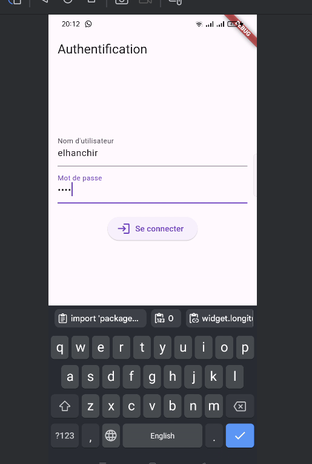
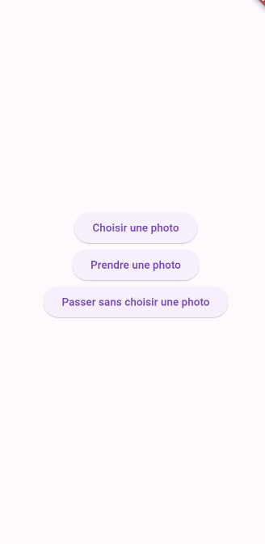
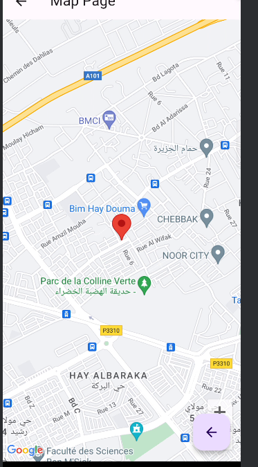
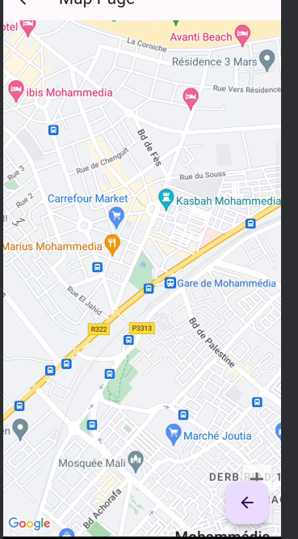

# Description

Ce projet est une application Flutter qui permet de choisir une photo depuis la galerie ou de prendre une nouvelle photo avec l'appareil photo du dispositif. Si la photo contient des données de géolocalisation, l'application affiche la position sur une carte Google Maps. Sinon, elle affiche simplement la carte sans position. L'utilisateur peut également revenir en arrière et choisir une autre photo.

## Fonctionnalités

- Authentification avec le nom d'utilisateur **elhanchir** et le mot de passe **1234**
-  
- Sélectionner une photo depuis la galerie
- 
- 
- Prendre une nouvelle photo avec l'appareil photo
- Afficher la position de la photo sur une carte Google Maps si des données de géolocalisation sont disponibles
- 
- Afficher la carte sans position si aucune donnée de géolocalisation n'est disponible
- 

## Dépendances

Ce projet utilise les dépendances suivantes :
- cupertino_icons: ^1.0.6
- google_maps_flutter: ^2.6.1
- image_picker: ^1.1.1
- exif: ^3.3.0
- location: ^6.0.2
- dio: ^5.4.3+1
- flutter_polyline_points: ^2.0.0

## Configuration

Assurez-vous d'avoir les clés API nécessaires pour utiliser les services Google Maps.
Vous devez également autoriser l'accès à la galerie et à l'appareil photo dans
le fichier AndroidManifest.xml pour les appareils Android et dans le fichier 
Info.plist pour les appareils iOS.


## Utilisation

1. Cloner le dépôt Git.
2. Ouvrir le projet dans un éditeur de code.
3. Exécuter la commande `flutter pub get` pour installer les dépendances.
4. Ajouter votre clé API Google Maps dans le fichier `android/app/src/main/AndroidManifest.xml` et dans le fichier `ios/Runner/AppDelegate.swift`.
   - Dans `android/app/src/main/AndroidManifest.xml`, ajoutez la clé API à l'intérieur de la balise `<application>` comme suit :
     ```xml
     <meta-data
         android:name="com.google.android.geo.API_KEY"
         android:value="YOUR_API_KEY"/>
     ```
   - Dans `ios/Runner/AppDelegate.swift`, ajoutez la clé API à la méthode `application(_:didFinishLaunchingWithOptions:)` comme suit :
     ```swift
     GMSServices.provideAPIKey("YOUR_API_KEY")
     ```
5. Exécuter l'application sur un émulateur ou un dispositif réel à l'aide de la commande `flutter run`.

Assurez-vous de remplacer `YOUR_API_KEY` par votre clé API Google Maps dans les fichiers mentionnés ci-dessus.

## Auteur

[ELHANCHIR MOHAMED GLSID2](https://github.com/MohamedElhanchir)